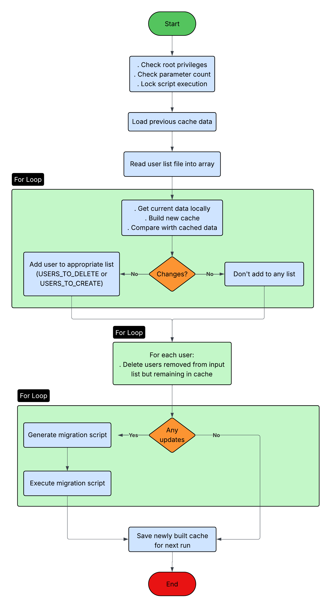

### Overview

---

The [`migrate.sh`](http://migrate.sh) script synchronizes user accounts between a local machine and a remote machine. 

The script will identify changes made to user accounts (created/modified/deleted), create a list of corresponding commands to make these changes, and execute these commands over a single ssh connection to the remote machine. 

### Quick Start

---

**To run the script:**

```bash
# Give script execute permissions:
chmod +x migrate.sh 

# Generate SSH key locally:
ssh-keygen -t rsa -b 4096

# Copy key to remote machine:
ssh-copy-key root@[ip address]

# Test ssh connection:
ssh root@[ip address]

# Run the script
sudo ./migrate.sh root@[ip address] [users_list.txt]
```

**To test the script**

Do all the above steps, but before running the script, create test users locally:

```bash
# Create test users locally:
sudo useradd -m -s /bin/bash testuser1 -c "Test User One"
sudo useradd -m -s /bin/bash testuser2 -c "Test User Two" 
sudo useradd -m -s /bin/bash testuser3 -c "Test User Three"

# Set passwords for the test users:
echo "testuser1:password123" | sudo chpasswd
echo "testuser2:password456" | sudo chpasswd
echo "testuser3:password789" | sudo chpasswd

# Run the script WITH PROVIDED TEST_USERS.TXT FILE
sudo ./migrate.sh root@[ip address] test_users.yxy
```

### How it Works

---

**Core Mechanisms:**

1. The script maintains a cache file that stores a snapshot of user data from the previous run. It compares the current state of users against it to identify changes
2. Instead of performing each update over a single SSH connection, the migrate.sh builds a script of commands to create/delete users. It executes that script in the remote machine over a single SSH connection.

**Process Overview:**


### Program Requirements

---

This program requires a list of usernames that corresponds to user accounts 

- This program must be run as the superuser so it can access /etc/shadow and the execution lock file that prevents more than one instance from running
- This program must be pre-authorized for SSH access on the remote machine using ssh-keygen
- Preauthorized access must be connected to

### Additional Notes

---

**Dealing with Deleted Users:**

Deleting users can lead to 2 scenarios:

1. Users are deleted locally but remain in users_list.txt
2. Deleted users are delete both locally and from users_list.txt

Since I was unsure about how users would be dealt with, I wrote the script to handle both/

Dealing with scenario 1 is easy. Script takes the username and checks if it is absent locally but present in the previous cache. If so, it adds the user to USERS_TO_DELETE.

Dealing with scenario 2 requires special handling. The script will iterate over all the values in the previous cache and look for them in the usernames from users_list.txt. If it finds a username that is not present in the users_list.txt, the user must have been deleted, and is added to USERS_TO_DELETE

**NOTE**: If deleted usernames remain in the users_list.txt, lines 347-353 from the script can be removed. 

**Group IDs**

The script is written to force group ID to 100 in create_remote_user() method. This was done for testing purposes. A comment in the method describes how to change that for real-life use.
